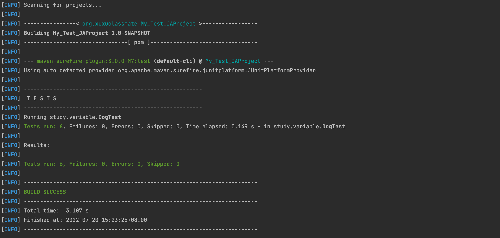

# JAVA基础学习

---
## 1、IO流体系-字符流

- [Reader](./src/study/ReaderDemoTest.java)

- [Writer](./src/study/ReaderDemoTest.java)

---
## 2、TestNG study

- [Funtion Demo](./src/TestNgStudy/ParamData.java)
- [TestCase_base Demo](./test/TestNgStudy/ParamDataTest.java)

TestCase_base Demo testng.xml config
```xml
<classes>
    <!-- TestNgStudy.ParamDataTes->package name-->
    <class name="TestNgStudy.ParamDataTest">
        <methods>
            <!--TestUserLogin1 -> funtion name-->
            <!--include -> use-->
            <include name="TestUserLogin1"></include>
            <!--exclude -> not use-->
            <exclude name="TestUserLogin2"/>
            <include name="TestUserLogin3"/>
            <include name="TestUserLogin4"/>
        </methods>
    </class>
</classes>
```

#

- [TestCase_plus Demo](./test/TestNgStudy/ParamDataPlusTest.java)

TestCase_plus Demo testng.xml config

```xml
<classes>
    <!-- TestNgStudy.ParamDataTes->package name-->
    <class name="TestNgStudy.ParamDataPlusTest">
        <methods>
            <parameter name="name" value="zhangsan"></parameter>
            <parameter name="pwd" value="123456"></parameter>
            <parameter name="result" value="欢迎zhangsan"></parameter>
            <include name="LoginTest"></include>
        </methods>
    </class>
</classes>
```

- [TestCase_plus Demo Data source](./test/LoginDataSource/LoginParams.java)

### 创建测试数据类的方法
```java
    @DataProvider
    public static   Object[][] getUsers() {
        return new Object[][]{};
    }
```

自动执行：
```shell
mvn surefire:test
```

### result：


