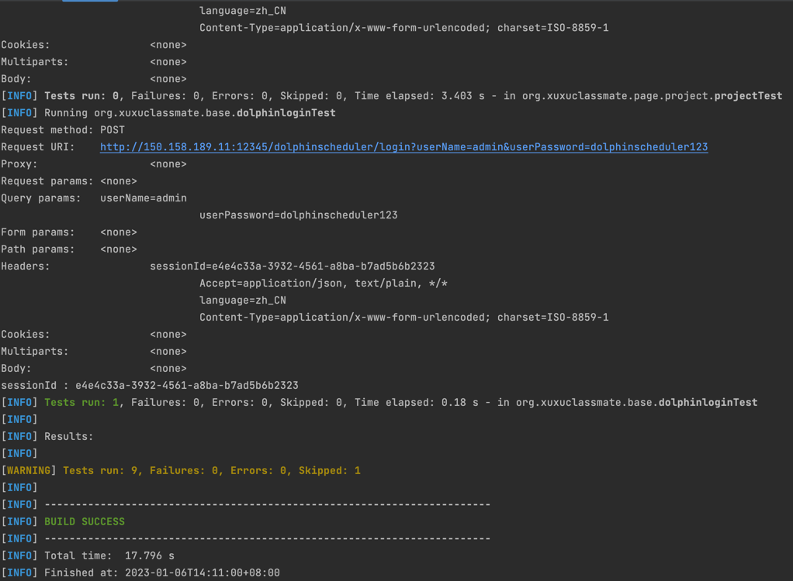
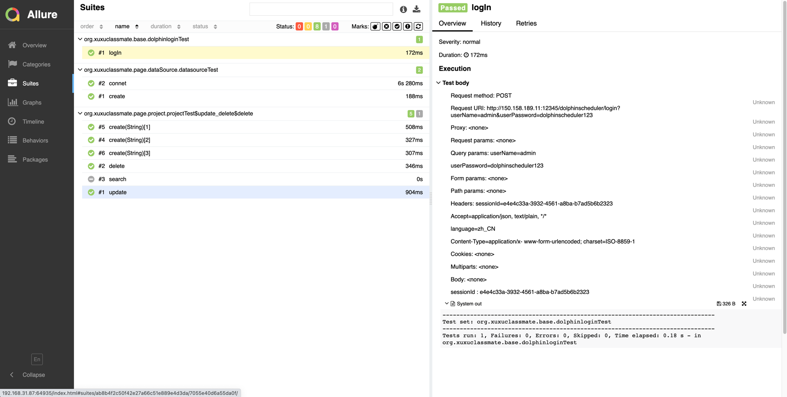
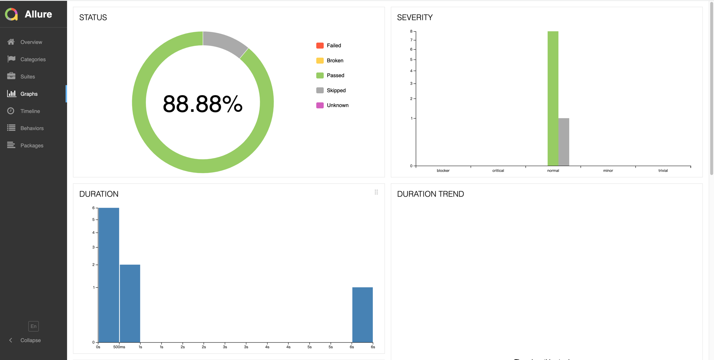

Hello Tester

I want to write a test case
The test items is Dolphin


The tools I use are

```shell
Java + Junit +Rest-Assured + Allure2
```
### 1、run test
```shell
mvn clean test
```



### 2、run Allure reports server
```shell
allure serve target/surefire-reports
```


